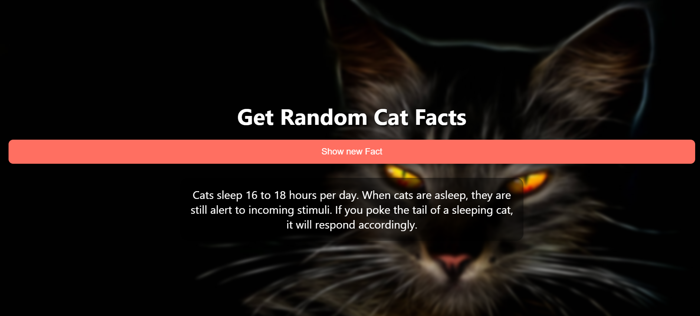

# CatFacts
A simple and visually appealing web application that generates random cat facts using an external API. Built with HTML, CSS, and JavaScript (with Axios for API calls). Perfect for cat lovers and beginners learning to work with APIs.

# 🐱 Random Cat Fact Generator

A fun and interactive web app that displays random cat facts using the [Cat Fact Ninja API](https://catfact.ninja/). Built with **HTML**, **CSS**, and **JavaScript**, and styled to be sleek and responsive. Axios is used for making API requests.

## 🚀 Features

- 🔁 Get new random cat facts at the click of a button
- 🎨 Beautiful UI with custom background and typography
- ⚡ Fast and asynchronous data fetching using Axios
- 📱 Mobile-friendly layout

## 📸 Preview

 

## 🛠️ Tech Stack

- HTML5
- CSS3 (with Google Fonts)
- JavaScript (ES6+)
- Axios (via CDN)

## 🐾 How to Use

1. Clone the repository:
   ```bash
   git clone https://github.com/yourusername/random-cat-fact-generator.git

2. Open index.html in your browser.

3. Click the "Show new Fact" button to load a new cat fact!